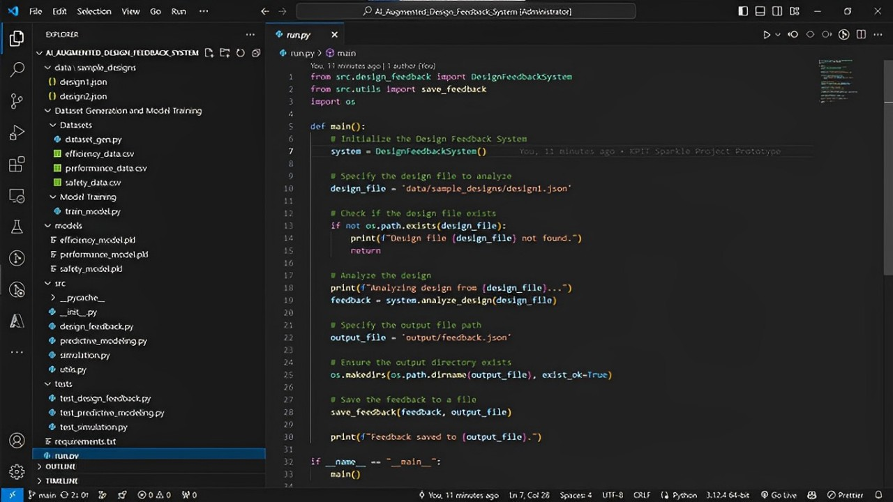

# AI-Augmented Design Feedback System

 <!-- Add a banner image if you have one -->

## Table of Contents
- [Introduction](#introduction)
- [Features](#features)
- [Project Structure](#project-structure)
- [Installation](#installation)
- [Usage](#usage)
- [Model Training](#model-training)
- [Contributing](#contributing)
- [License](#license)
- [Acknowledgements](#acknowledgements)

## Introduction

The AI-Augmented Design Feedback System is an innovative solution aimed at enhancing mechanical design processes by providing AI-powered feedback on efficiency, safety, and performance. This system utilizes simulations and predictive modeling to suggest improvements, thereby optimizing the product development lifecycle.

## Features

- **Efficiency Analysis**: Automatically evaluate design efficiency and suggest improvements.
- **Safety Assessment**: Predict potential safety issues based on design parameters.
- **Performance Optimization**: Analyze and optimize design performance through predictive modeling.
- **Simulation Capabilities**: Run simulations to foresee design outcomes and refine models.
- **Extensible Framework**: Easily integrate with other engineering platforms or tools.

## Project Structure

AI_Augmented_Design_Feedback_System/
│
├── data/
│   ├── sample_designs/
│   │   ├── design1.json
│   │   └── design2.json
│   └── generated_data/
│
├── models/
│   ├── efficiency_model.pkl
│   ├── performance_model.pkl
│   └── safety_model.pkl
│
├── src/
│   ├── design_feedback.py
│   ├── predictive_modeling.py
│   └── simulations.py
│
├── Dataset Generation and Model Training/
│   ├── Model Training/
│   │   └── train_model.py
│   └── Data Generation/
│       ├── efficiency_data.py
│       ├── performance_data.py
│       └── safety_data.py
│
├── tests/
│   ├── test_design_feedback.py
│   ├── test_predictive_modeling.py
│   └── test_simulations.py
│
└── run.py


## Installation

1. Clone this repository:
   ```bash
   git clone https://github.com/your_username/AI_Augmented_Design_Feedback_System.git
   
2. Navigate to the project directory:
   
   cd AI_Augmented_Design_Feedback_System

3. Install the required packages:

     pip install -r requirements.txt

## Usage

1. Analyzing a Design:

- Run the run.py script to analyze a design:
   python run.py

2. Testing:

- Run unit tests to ensure everything is functioning as expected
   pytest tests/


## Model Training

To train the models:

- Generate datasets by running the scripts in Data Generation.
- Train the models using the scripts in Model Training.
- Models will be saved in the models/ directory.


## Contributing
Contributions are welcome! Please fork this repository and submit a pull request for review.

##License
This project is licensed under the MIT License. See the LICENSE file for more details.

##Acknowledgements
- Tools Used: Python, scikit-learn, pandas, NumPy, etc.
- Inspiration: Inspired by the need for automation in mechanical design evaluations.
